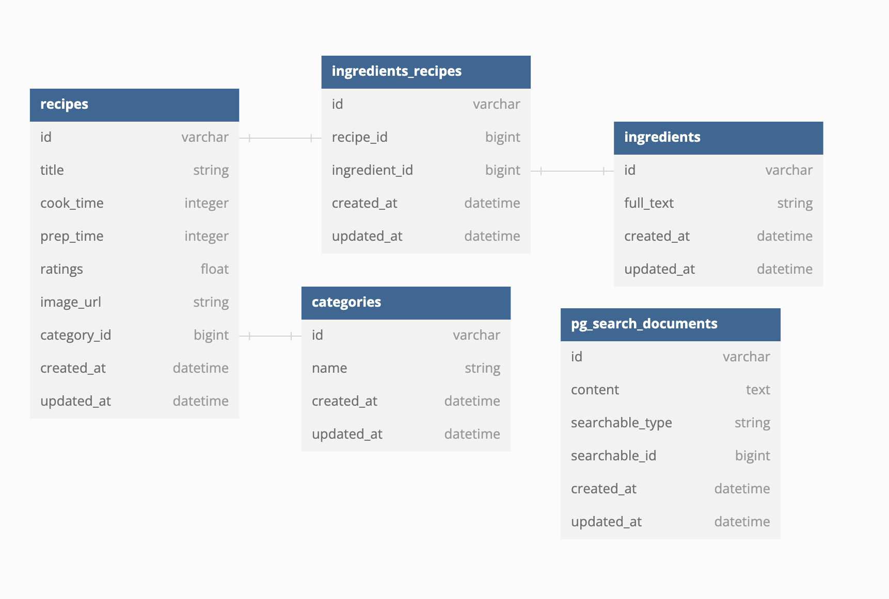

[](https://github.com/aurelienbottazini/chefscompanion/actions/workflows/specs.yml)

[](https://github.com/aurelienbottazini/chefscompanion/actions/workflows/deploy.yml)


## Dev

- Install dependencies `bundle install` and `npm install`
- Install foreman `gem install foreman` ([do not add as a dependency](https://github.com/ddollar/foreman/wiki/Don't-Bundle-Foreman))
- Start the app with `foreman start -f Procfile.dev`
- Run specs with `bundle exec rspec`
- Watch specs with `bundle exec guard`

## Prod

Continuous deployment on merges to main -> https://chefscompanion.fly.dev

Create a proxy to the database:

    fly proxy 5432:5432 -a chefscompanion-db

Connect to the database using your regular tools

## db schema



## User stories 

Project managed with https://github.com/users/aurelienbottazini/projects/2/views/1

User stories completed:
- As cook I want to filter recipes by ingredient
- As cook I want to be able to query with a list of words against the list of recipes and get the best possible matches

## Notes

- there is a `rake recipes:seed` task to seed the database with the recipes. It is fast enough for now (17s), but it could be improved by using a bulk insert strategy with prepared statements.
- I did not focus on testing the app. In the limited time I had, I think it was more important to setup continuous deployment and to use React for the views. 
- ideas for improvements:
  - fuzzy search ingredients (with postgres `fuzzystrmatch` extension)
  - see a cloud of most common ingredients when the search bar is empty

## Problem statement

> **It's dinner time ! Create an application that helps users find the most relevant recipes that they can prepare with the ingredients that they have at home**

## Objective

Deliver an application prototype to answer the above problem statement.

By prototype, we mean:
- something usable, yet as simple as possible
- UI / design is not important
- we do not expect features which are outside the basic scope of the problem

We expect to use this prototype as a starting point to discuss current implenentation details, as well as ideas for improvement.

#### Tech must-haves
- [X] MySQL / PostgreSQL or any other MySQL-compatible database.
- [X] A backend application which responds to queries
- [X] A web interface (can be VERY simple)
- [X] Ruby on Rails (if you're not familiar with Ruby on Rails, use something you're familiar with)

#### Bonus points
- [X] React
- [X] Application is hosted on fly.io

## Data
We provide two datasets to choose from:
- [french-language recipes](https://pennylane-interviewing-assets-20220328.s3.eu-west-1.amazonaws.com/recipes-fr.json.gz) scraped from www.marmiton.org with [python-marmiton](https://github.com/remaudcorentin-dev/python-marmiton)
- [english-language recipes](https://pennylane-interviewing-assets-20220328.s3.eu-west-1.amazonaws.com/recipes-en.json.gz) scraped from www.allrecipes.com with [recipe-scrapers](https://github.com/hhursev/recipe-scrapers)

Download it with this command if the above link doesn't work:
```shell
wget https://pennylane-interviewing-assets-20220328.s3.eu-west-1.amazonaws.com/recipes-en.json.gz && gzip -dc recipes-en.json.gz > recipes-en.json
```

## Deliverable
- the 2-3 user stories which the application implements
- the codebase : in a git repo (share it with @quentindemetz @tdeo @soyoh @lucasbonin @sforsell @clemalfroy @dmilon @pointcom @evangelos-fotis @thecodehunter)
- the database structure
- the application, running on fly.io or on a personal server.
- please submit links to the GitHub repo and the hosted application [via this form](https://forms.gle/siH7Rezuq2V1mUJGA) and if you're on Mac, make sure your browser has permission to share the screen
